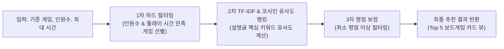
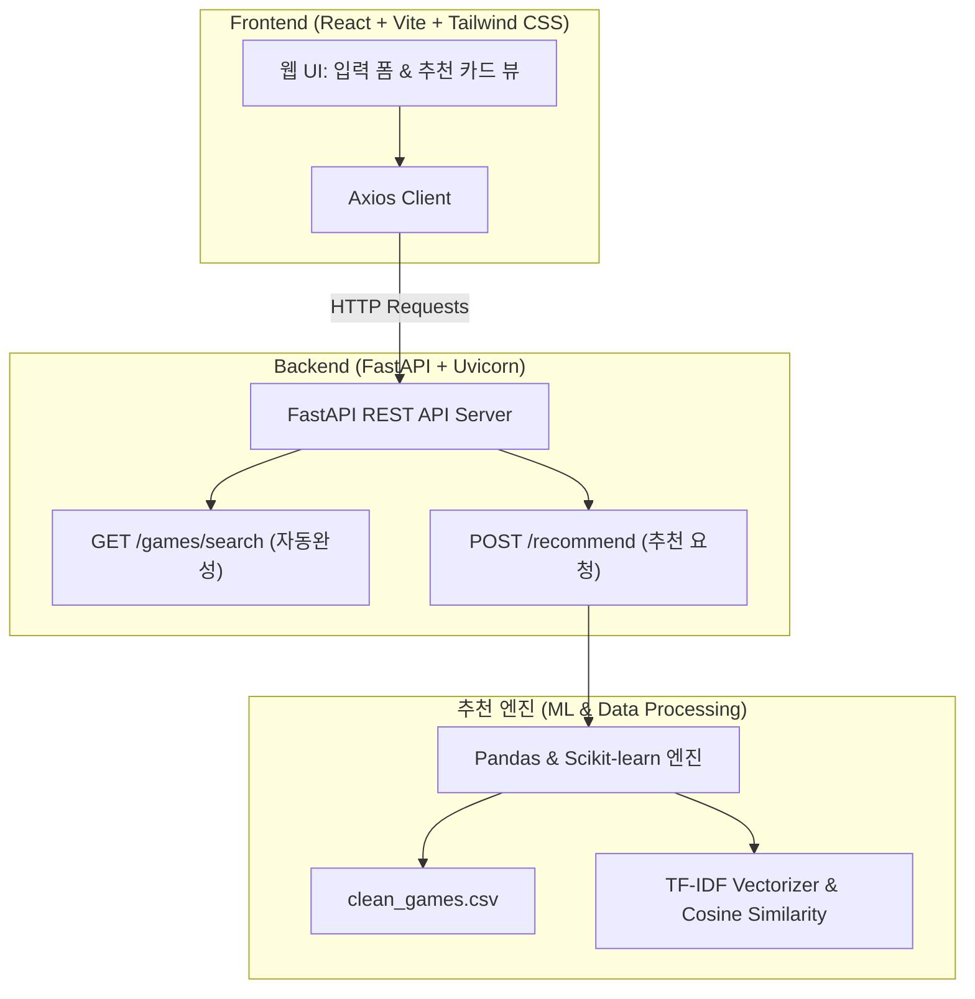

# 🎲 BoardGame Recommender (보드게임 추천 시스템)

<div align="center">


<br/>

**사용자의 조건(인원, 플레이 시간)과 취향(게임 테마 및 메커니즘)에 딱 맞는 최적의 보드게임을 찾아주는 머신러닝 기반 추천 웹 서비스**

[📖 프로젝트 상세 계획서](docs/project_plan.md) • [⚙️ 개발 환경 세팅 가이드](docs/setup.md)

</div>

---

## 📌 목차
1. [프로젝트 개요](#-프로젝트-개요)
2. [핵심 기능 및 추천 로직](#-핵심-기능-및-추천-로직)
3. [시스템 아키텍처](#-시스템-아키텍처)
4. [기술 스택](#️-기술-스택)
5. [데이터셋 안내](#-데이터셋-안내)
6. [프로젝트 구조](#-프로젝트-구조)
7. [7주차 개발 로드맵](#-7주차-개발-로드맵)
8. [시작 가이드 (Quick Start)](#-시작-가이드-quick-start)

---

## 🎯 프로젝트 개요

* **프로젝트명**: 보드게임 추천 시스템 (BoardGame Recommender)
* **목표**: BoardGameGeek(BGG)의 방대한 보드게임 데이터를 정제하고, TF-IDF 및 코사인 유사도 분석을 거쳐 FastAPI 백엔드와 React 프론트엔드로 이어지는 풀스택 추천 웹 서비스 구축
* **수행 기간**: 총 7주 (주당 6~8시간 학습 및 실습)
* **참여 인원**: 4명

---

## 💡 핵심 기능 및 추천 로직

본 추천 시스템은 단순 평점 순 나열이 아닌, **사용자의 상황 제약 조건**과 **선호 게임 간의 텍스트 콘텐츠 유사도**를 결합한 **3단계 파이프라인**을 제공합니다.



1. **1차 하드 필터링 (조건 제약 만족)**
   - 참여 인원(`MinPlayers` ~ `MaxPlayers` 및 `BestPlayers`)에 해당하는 게임 필터링
   - 가용 시간(`ComMinPlaytime`) 조건 이하의 게임 필터링
2. **2차 유사도 랭킹 (콘텐츠 기반 추천)**
   - 보드게임 설명문(`Description`)을 바탕으로 `TfidfVectorizer`를 이용해 핵심 키워드 벡터화
   - 기준 게임과 후보 게임 간의 `cosine_similarity`(코사인 유사도)를 계산하여 유사도 순으로 랭킹 산출
3. **3차 보정 (퀄리티 보장)**
   - 신뢰성 높은 평가 지표인 `BayesAvgRating`(베이지안 평균 평점) 5.5 이상 선별 후 Top 5 추천

---

## 🏗️ 시스템 아키텍처



---

## 🛠️ 기술 스택

| 분류 | 기술 / 도구 | 용도 |
| :--- | :--- | :--- |
| **Environment** | `Anaconda`, `Python 3.12` | 가상환경 격리 및 패키지 관리 |
| **Data & ML** | `Pandas`, `NumPy`, `Scikit-learn` | 데이터 전처리, 결측치/이상치 정제, TF-IDF 벡터화, 코사인 유사도 분석 |
| **Backend** | `FastAPI`, `Uvicorn` | 비동기 고성능 RESTful API 서버 구현 및 Swagger UI 문서화 |
| **Frontend** | `React`, `Vite`, `Tailwind CSS`, `Axios` | 직관적인 사용자 입력 인터페이스 및 결과 카드 컴포넌트 구현 |
| **Collaboration** | `Git`, `GitHub`, `Jupyter Lab`, `VS Code` | 버전 관리, 데이터 탐색(EDA) 및 협업 환경 |

---

## 📊 데이터셋 안내

본 프로젝트는 BoardGameGeek(BGG)의 게임 메타데이터가 담긴 `data/games.csv`를 사용합니다.

| 컬럼명 | 설명 | 비고 |
| :--- | :--- | :--- |
| `Name` | 보드게임 이름 | 기준 게임 검색 및 출력 |
| `YearPublished` | 출시 연도 | 게임 정보 메타데이터 |
| `GameWeight` | 게임 난이도 (체감 복잡도 1~5) | 추천 카드 정보 표시 |
| `MinPlayers` / `MaxPlayers` | 최소/최대 플레이 가능 인원 | 1차 필터링 기준 |
| `BestPlayers` | 가장 추천되는 최적 인원수 | 1차 필터링 기준 (`['3', '4']` 전처리 필요) |
| `ComMinPlaytime` | 예상 최소 플레이 시간 (분) | 1차 시간 필터링 기준 |
| `BayesAvgRating` | 베이지안 평균 평점 | 3차 보정 필터 기준 (5.5 이상) |
| `Description` | 게임 설명글 (영어 원문) | TF-IDF 키워드 유사도 분석 원천 |
| `ImagePath` | 게임 표지 이미지 URL | 프론트엔드 카드 뷰 렌더링 |

---

## 📁 프로젝트 구조

```text
boardgame-recommender/
├── data/                      # 데이터셋 디렉토리
│   └── games.csv              # 원본 BGG 데이터셋
├── docs/                      # 프로젝트 문서 및 가이드
│   ├── project_plan.md        # 프로젝트 상세 계획서
│   └── setup.md               # 개발 환경 세팅 가이드
├── src/                       # 데이터 분석 및 추천 알고리즘 소스코드
├── backend/                   # FastAPI 백엔드 API 서버 (생성 예정)
├── frontend/                  # React 프론트엔드 웹 애플리케이션 (생성 예정)
├── .gitignore
└── README.md
```

---

## 📅 7주차 개발 로드맵

- [ ] **1주차: 환경 구축 & 데이터셋 탐색 (EDA)**
  - Anaconda 환경 구축 및 팀원 간 개발 환경 일치
  - `games.csv` 데이터 불러오기 및 기본 행/열/타입 분석 (`df.info()`, `df.describe()`)
- [ ] **2주차: 데이터 정제 (이상치/결측치 처리)**
  - `Description`, `Name` 결측치 제거
  - 비정상 플레이 타임 및 플레이 인원 이상치 필터링
  - `BestPlayers` 컬럼 파싱 및 `clean_games.csv` 생성
- [ ] **3주차: TF-IDF & 코사인 유사도 분석**
  - 설명글 텍스트 전처리 및 `TfidfVectorizer` 적용 (핵심 피처 추출)
  - 코사인 유사도(`cosine_similarity`) 매트릭스 계산 및 유사 게임 도출 실습
- [ ] **4주차: 추천 파이프라인 함수 구현**
  - 1차 조건 하드 필터링 + 2차 텍스트 유사도 정렬 + 3차 평점 보정 통합
  - `recommend_games(game_name, players, max_time)` 완성
- [ ] **5주차: FastAPI 백엔드 서버 구축**
  - `/games/search` (게임 검색), `/recommend` (추천 결과 반환) API 엔드포인트 작성
  - Swagger UI(`http://localhost:8000/docs`)를 통한 API 기능 검증
- [ ] **6주차: React 프론트엔드 웹 UI 개발**
  - Vite + Tailwind CSS 기반 모던 UI 구성
  - 게임 선택, 인원수, 플레이 시간 입력 폼 및 결과 카드 뷰 제작
- [ ] **7주차: 서비스 연동, 예외 처리 & 시연**
  - 프론트엔드-백엔드 Axios 연동 및 CORS 처리
  - 검색 결과 없음 등 예외 상황 처리 및 팀 프로젝트 최종 시연

---

## 🚀 시작 가이드 (Quick Start)

### 1. 가상환경 생성 및 활성화
```bash
# 가상환경 생성 (Python 3.12)
conda create -n bg_rec python=3.12 -y

# 가상환경 활성화
conda activate bg_rec
```

### 2. 필수 라이브러리 설치
```bash
# 데이터 분석 및 머신러닝 라이브러리 설치
conda install pandas numpy matplotlib scikit-learn jupyterlab -c conda-forge -y

# 백엔드 API 라이브러리 설치 (5주차)
conda install fastapi uvicorn -c conda-forge -y
```

### 3. 백엔드 실행 (5주차~)
```bash
cd backend
uvicorn main:app --reload
# 접속 주소: http://localhost:8000
# API 문서 (Swagger): http://localhost:8000/docs
```

### 4. 프론트엔드 실행 (6주차~)
```bash
cd frontend
npm install
npm run dev
```

> 💡 더 자세한 환경 구축 절차는 [docs/setup.md](docs/setup.md)를 참고하세요.

---

## 📜 라이선스 및 참고 자료
* **데이터 출처**: [BoardGameGeek (BGG)](https://boardgamegeek.com/)
* **상세 기획 및 주차별 계획**: [docs/project_plan.md](docs/project_plan.md)
